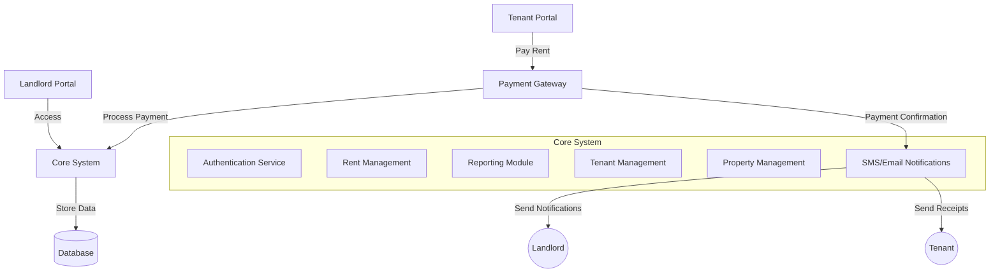

This is a [Next.js](https://nextjs.org) project bootstrapped with [`create-next-app`](https://nextjs.org/docs/app/api-reference/cli/create-next-app).

## Getting Started

First, run the development server:

```bash
npm run dev
# or
yarn dev
# or
pnpm dev
# or
bun dev
```

Open [http://localhost:3000](http://localhost:3000) with your browser to see the result.

You can start editing the page by modifying `app/page.tsx`. The page auto-updates as you edit the file.

This project uses [`next/font`](https://nextjs.org/docs/app/building-your-application/optimizing/fonts) to automatically optimize and load [Geist](https://vercel.com/font), a new font family for Vercel.

## Learn More

To learn more about Next.js, take a look at the following resources:

- [Next.js Documentation](https://nextjs.org/docs) - learn about Next.js features and API.
- [Learn Next.js](https://nextjs.org/learn) - an interactive Next.js tutorial.

You can check out [the Next.js GitHub repository](https://github.com/vercel/next.js) - your feedback and contributions are welcome!

## Deploy on Vercel

The easiest way to deploy your Next.js app is to use the [Vercel Platform](https://vercel.com/new?utm_medium=default-template&filter=next.js&utm_source=create-next-app&utm_campaign=create-next-app-readme) from the creators of Next.js.

Check out our [Next.js deployment documentation](https://nextjs.org/docs/app/building-your-application/deploying) for more details.


## Rental Management System
A rental management system for Kenyan landlords. Let's break this down into key components and create a solution that addresses the trust issues while providing convenient rent management.




Here's a detailed breakdown of the proposed system:

### 1. Key Features for Landlords:
   - Real-time rent collection tracking
   - Automated payment reconciliation
   - Property and unit management
   - Tenant information management
   - Financial reporting and analytics
   - Payment history and arrears tracking
   - Automated receipting system

### 2. Tenant Features:
   - Online rent payment portal
   - Payment history access
   - Digital receipts
   - Maintenance request submission
   - Account statements

### 3. Technical Implementation:
   - Web-based portal for both landlords and tenants
   - Mobile-responsive design for accessibility
   - Integration with M-Pesa and other payment systems
   - Automated SMS/email notifications
   - Secure authentication system
   - Data backup and recovery systems

### 4. Security Measures:
   - Role-based access control
   - Encrypted data transmission
   - Secure payment processing
   - Audit trails for all transactions
   - Two-factor authentication

### 5. Reports Generation:
   - Monthly collection reports
   - Occupancy reports
   - Payment status reports
   - Revenue analysis
   - Defaulter tracking

